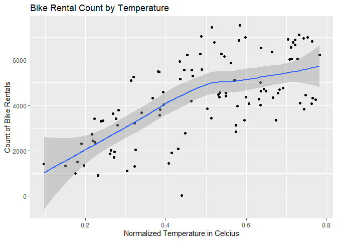

Bike Data Project - ST558
================
Lucy Eckert
10/8/2020

  - [ST 558 Project \#2, Group B - Predicting Bike Rental
    Totals](#st-558-project-2-group-b---predicting-bike-rental-totals)
      - [Introduction and Supporting
        Information](#introduction-and-supporting-information)
          - [Introduction](#introduction)
          - [Supporting Information](#supporting-information)
          - [Information about Variable
            Selection](#information-about-variable-selection)
      - [Work with Data](#work-with-data)

# ST 558 Project \#2, Group B - Predicting Bike Rental Totals

## Introduction and Supporting Information

### Introduction

``` 
+ I used data from the [Capital Bikeshare Program](https://www.capitalbikeshare.com/), 
which is a bike sharing program based in the Metro D.C. area of the United States. 
I reviewed data from 2011 and 2012, and used various predictors to create models 
that would predict the daily total of bike rentals.  
```

### Supporting Information

``` 
+ For this project, I am using a number of packages in R. They include, Tidyverse, Readr, Caret, GGplot2,   
```

### Information about Variable Selection

Below I have included a quick note about each variable. - *instant*:
This variable has been removed from my prediction dataset as is simply a
record index.  
\- *dteday*: This variable has been removed from my prediction dataset
as it does not contribute to the prediction.

  - *season*: Indicates season (1:winter, 2:spring, 3:summer, 4:fall). I
    have converted these to a dummy variable, to indicate the absence or
    presence of some categorical effect that may be expected to shift
    the outcome.

  - *yr*: Indicates year: (0: 2011, 1:2012)

  - *mnth*: Indicates month: ( 1 to 12)

  - *holiday*: Indicates whether day is holiday or not (extracted from
    [Web Link](https://dchr.dc.gov/page/holiday-schedules))

  - *weekday*: Day of the week, with Monday being 1.

  - workingday : Removed, as is complementary to holiday

  - *weathersit*: Indicates weather category. I have converted these to
    a dummy variable, to indicate the absence or presence of some
    categorical effect that may be expected to shift the outcome.
    Descriptions follow

  - 1: Clear, Few clouds, Partly cloudy, Partly cloudy

  - 2: Mist + Cloudy, Mist + Broken clouds, Mist + Few clouds, Mist

  - 3: Light Snow, Light Rain + Thunderstorm + Scattered clouds, Light
    Rain + Scattered clouds

  - 4: Heavy Rain + Ice Pallets + Thunderstorm + Mist, Snow + Fog

  - *temp* : Normalized temperature in Celsius.

  - *atemp*: Normalized feeling temperature in Celsius.

  - *hum*: Normalized humidity. The values are divided to 100 (max)

  - *windspeed*: Normalized wind speed. The values are divided to 67
    (max)

  - *cnt*: THe variable I am building models to predict, it is the count
    of total rental bikes including both casual and registered

<!-- end list -->

    ## -- Attaching packages ------------------------------ tidyverse 1.3.0 --

    ## v ggplot2 3.3.2     v purrr   0.3.4
    ## v tibble  3.0.3     v dplyr   1.0.1
    ## v tidyr   1.1.1     v stringr 1.4.0
    ## v readr   1.3.1     v forcats 0.5.0

    ## -- Conflicts --------------------------------- tidyverse_conflicts() --
    ## x dplyr::filter() masks stats::filter()
    ## x dplyr::lag()    masks stats::lag()

    ## Loading required package: lattice

    ## 
    ## Attaching package: 'caret'

    ## The following object is masked from 'package:purrr':
    ## 
    ##     lift

## Work with Data

Create relative path, pull in data, and create Monday dataset.

``` r
data.path <- "C:/Users/leckert/Documents/NCSU/ST558/Project_2"
day <- read_csv(paste0(data.path,"/day.csv"))
```

    ## Parsed with column specification:
    ## cols(
    ##   instant = col_double(),
    ##   dteday = col_date(format = ""),
    ##   season = col_double(),
    ##   yr = col_double(),
    ##   mnth = col_double(),
    ##   holiday = col_double(),
    ##   weekday = col_double(),
    ##   workingday = col_double(),
    ##   weathersit = col_double(),
    ##   temp = col_double(),
    ##   atemp = col_double(),
    ##   hum = col_double(),
    ##   windspeed = col_double(),
    ##   casual = col_double(),
    ##   registered = col_double(),
    ##   cnt = col_double()
    ## )

``` r
Monday <- day %>% filter(weekday==1) %>% select(-c(casual,registered, instant, dteday))
```

Review Data by Summaries and Plots

``` r
#Rentals by Temperature
a <- ggplot(Monday, aes(temp, cnt))
a + geom_jitter() +geom_smooth() +labs(title = "Bike Rental Count by Temperature", 
                                       x = "Normalized Temperature in Celcius", 
                                       y = "Count of Bike Rentals")
```

    ## `geom_smooth()` using method = 'loess' and formula 'y ~ x'

<!-- -->

``` r
#Rentals by Season
b <- ggplot(Monday, aes(x = season, y = cnt))
b + geom_bar(stat = "identity", aes(y=cnt, fill="Season"), colour="green") + labs(title = "Bike Rental Count by Season", x = "Season", y = "Count of Bike Rentals") + scale_fill_discrete(name = "Seasons:", 
       labels = c("Winter", "Spring", "Summer", "Fall")) 
```

<!-- -->

``` r
#Rentals by Weather Type
c <- ggplot(Monday, aes(x = weathersit, y = cnt))
c + geom_bar(stat = "identity", aes(y=cnt, fill="Weather"), colour="green") + 
  labs(title = "Bike Rental Count by Weather Type", x = "Weather Type", y = "Count of Bike Rentals") +   scale_fill_discrete(name = "Weather:") 
```

<!-- -->

Create train and test data sets for Monday data. Clean data.

``` r
set.seed(1)
trainIndex <- createDataPartition(Monday$cnt, p = 0.7, list = FALSE)
Monday.Train <- Monday[trainIndex, ] %>% select(-c(workingday, weekday)) %>% 
  mutate(mnth=as.factor(mnth), season=as.factor(season), weathersit = as.factor(weathersit))
Monday.Test <-  Monday[-trainIndex, ]
```

Use summary statistics and plots to review predictors and start to think
about creating models.
