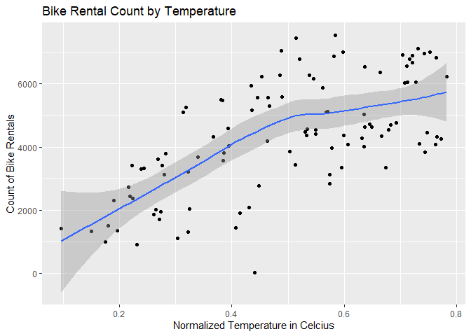
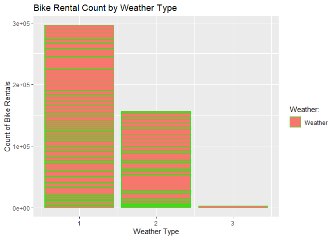

Bike Data Project - ST558
================
Lucy Eckert
10/8/2020

  - [ST 558 Project \#2, Group B - Predicting Bike Rental
    Totals](#st-558-project-2-group-b---predicting-bike-rental-totals)
      - [Introduction and Supporting
        Information](#introduction-and-supporting-information)
          - [Introduction](#introduction)
          - [Supporting Information](#supporting-information)
          - [Information about Variable
            Selection](#information-about-variable-selection)
      - [Work with Data](#work-with-data)
          - [Build Models for Monday Train
            Data](#build-models-for-monday-train-data)
          - [Automate to Tuesday:Sunday
            Data](#automate-to-tuesdaysunday-data)

# ST 558 Project \#2, Group B - Predicting Bike Rental Totals

## Introduction and Supporting Information

### Introduction

``` 
+ I used data from the [Capital Bikeshare Program](https://www.capitalbikeshare.com/), 
which is a bike sharing program based in the Metro D.C. area of the United States. 
I reviewed data from 2011 and 2012, and used various predictors to create models 
that would predict the daily total of bike rentals.  
```

### Supporting Information

``` 
+ For this project, I am using a number of packages in R. They include, Tidyverse, 
Readr, Caret, GGplot2, tree, dplyr, knitr, party, gbm,    
```

### Information about Variable Selection

Below I have included a quick note about each variable. - **instant**:
This variable has been removed from my prediction dataset as is simply a
record index.  
\- **dteday**: This variable has been removed from my prediction dataset
as it does not contribute to the prediction.

  - **season**: Indicates season (1:winter, 2:spring, 3:summer, 4:fall).
    I have converted these to a dummy variable, to indicate the absence
    or presence of some categorical effect that may be expected to shift
    the outcome.

  - **yr**: Indicates year: (0: 2011, 1:2012)

  - **mnth**: Indicates month: ( 1 to 12)

  - **holiday**: Indicates whether day is holiday or not (extracted from
    [Web Link](https://dchr.dc.gov/page/holiday-schedules))

  - **weekday**: Day of the week, with Monday being 1.

  - workingday : Removed, as is complementary to holiday

  - **weathersit**: Indicates weather category. I have converted these
    to a dummy variable, to indicate the absence or presence of some
    categorical effect that may be expected to shift the outcome.
    Descriptions follow

  - 1: Clear, Few clouds, Partly cloudy, Partly cloudy

  - 2: Mist + Cloudy, Mist + Broken clouds, Mist + Few clouds, Mist

  - 3: Light Snow, Light Rain + Thunderstorm + Scattered clouds, Light
    Rain + Scattered clouds

  - 4: Heavy Rain + Ice Pallets + Thunderstorm + Mist, Snow + Fog

  - **temp** : Normalized temperature in Celsius.

  - **atemp**: Normalized feeling temperature in Celsius.

  - **hum**: Normalized humidity. The values are divided to 100 (max)

  - **windspeed**: Normalized wind speed. The values are divided to 67
    (max)

  - **cnt**: The variable I am building models to predict, it is the
    count of total rental bikes including both casual and registered

## Work with Data

Create relative path, pull in data, and create Monday dataset.

``` r
data.path <- "C:/Users/leckert/Documents/NCSU/ST558/Project_2"
day <- read_csv(paste0(data.path,"/day.csv"))
```

    ## Parsed with column specification:
    ## cols(
    ##   instant = col_double(),
    ##   dteday = col_date(format = ""),
    ##   season = col_double(),
    ##   yr = col_double(),
    ##   mnth = col_double(),
    ##   holiday = col_double(),
    ##   weekday = col_double(),
    ##   workingday = col_double(),
    ##   weathersit = col_double(),
    ##   temp = col_double(),
    ##   atemp = col_double(),
    ##   hum = col_double(),
    ##   windspeed = col_double(),
    ##   casual = col_double(),
    ##   registered = col_double(),
    ##   cnt = col_double()
    ## )

``` r
#Filter out Monday data, and remove unused variables
Monday <- day %>% filter(weekday==1) %>% select(-c(casual,registered, instant, dteday))
```

Review Data by Summaries and Plots

``` r
#Rentals by Temperature
a <- ggplot(Monday, aes(temp, cnt))
a + geom_jitter() +geom_smooth() +labs(title = "Bike Rental Count by Temperature", 
                                       x = "Normalized Temperature in Celcius", 
                                       y = "Count of Bike Rentals")
```

    ## `geom_smooth()` using method = 'loess' and formula 'y ~ x'

<!-- -->

``` r
#Rentals by Season
b <- ggplot(Monday, aes(x = season, y = cnt))
b + geom_bar(stat = "identity", aes(y=cnt, fill="Season"), colour="green") + labs(title = "Bike Rental Count by Season", x = "Season", y = "Count of Bike Rentals") + scale_fill_discrete(name = "Seasons:", 
       labels = c("Winter", "Spring", "Summer", "Fall")) 
```

<!-- -->

``` r
#Rentals by Weather Type
c <- ggplot(Monday, aes(x = weathersit, y = cnt))
c + geom_bar(stat = "identity", aes(y=cnt, fill="Weather"), colour="green") + 
  labs(title = "Bike Rental Count by Weather Type", x = "Weather Type", y = "Count of Bike Rentals") +   scale_fill_discrete(name = "Weather:") 
```

<!-- -->

Review Summary Stats for Continuous Variables

``` r
summary_data <- Monday %>% select(temp:windspeed)
kable(apply(summary_data, 2, summary), caption = paste("Summary Stats for Continuous Variables"), 
      digit = 2)
```

|         | temp | atemp |  hum | windspeed |
| :------ | ---: | ----: | ---: | --------: |
| Min.    | 0.10 |  0.12 | 0.30 |      0.04 |
| 1st Qu. | 0.33 |  0.34 | 0.52 |      0.13 |
| Median  | 0.51 |  0.50 | 0.65 |      0.18 |
| Mean    | 0.49 |  0.47 | 0.64 |      0.19 |
| 3rd Qu. | 0.64 |  0.60 | 0.74 |      0.24 |
| Max.    | 0.78 |  0.73 | 0.92 |      0.42 |

Summary Stats for Continuous Variables

Create train and test data sets for Monday data. Clean data.

``` r
set.seed(1)
trainIndex <- createDataPartition(Monday$cnt, p = 0.7, list = FALSE)
Monday.Train <- Monday[trainIndex, ] 
Monday.Test <-  Monday[-trainIndex, ]
```

### Build Models for Monday Train Data

Model 1: Non-Ensemble Tree

``` r
Monday       <- day %>% filter(weekday==1) %>% select(-c(casual,registered, instant, dteday))
trainIndex   <- createDataPartition(Monday$cnt, p = 0.7, list = FALSE)
Monday.Train <- Monday[trainIndex, ] %>% select(-c(workingday, weekday)) %>% 
  mutate(mnth=as.factor(mnth), season=as.factor(season), weathersit = as.factor(weathersit))
dmy          <- dummyVars(" ~ .", data = Monday.Train, fullRank = T)
Monday.Train.trf <- data.frame(predict(dmy, newdata = Monday.Train)) %>% mutate(y = scale(cnt)) %>% select(-cnt)
fitControl <- trainControl(method = "LOOCV")
model      <- train(y ~., data = Monday.Train.trf, method = "ctree",
                    trControl = fitControl)
print(model)
```

    ## Conditional Inference Tree 
    ## 
    ## 76 samples
    ## 21 predictors
    ## 
    ## No pre-processing
    ## Resampling: Leave-One-Out Cross-Validation 
    ## Summary of sample sizes: 75, 75, 75, 75, 75, 75, ... 
    ## Resampling results across tuning parameters:
    ## 
    ##   mincriterion  RMSE       Rsquared   MAE      
    ##   0.01          0.5114407  0.7397484  0.3809367
    ##   0.50          0.5061279  0.7448855  0.3671482
    ##   0.99          0.5020098  0.7468483  0.3747121
    ## 
    ## RMSE was used to select the optimal model using the smallest value.
    ## The final value used for the model was mincriterion = 0.99.

``` r
plot(model$finalModel)
```

<!-- -->

Model 2: Boosted Tree ADD SELECTION DISCUSSION

``` r
set.seed(1)
boostFit1 <- gbm(cnt ~., data = Monday.Train, distribution = "gaussian", n.trees = 100,
                 shrinkage = .1, interaction.depth = 2)
boostPred <- predict(boostFit1, newdata = dplyr::select(Monday.Test, -cnt), n.trees = 100)
boostRMSE <- sqrt(mean((boostPred-Monday.Test$cnt)^2))
#Print RMSE
boostRMSE
```

    ## [1] 821.8316

### Automate to Tuesday:Sunday Data
